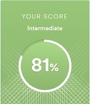

# Kanstantsin Davydovich
## Contact information:
Resource | Link
----------|----------------------
E-mail     |  kostiarabota@gmail.com
GitHub     |  https://github.com/ConstantineIgorevich

## About Myself

I really want to become a front-end developer.

## Skills

* HTML
* CSS
* JS (basic)

## Code example

It's task from Kata Traning:

>After your function finds the needle it should return a message (as a string) that says: "found the needle at position " plus the index.
```
function findNeedle(haystack) {
  for(let index = 0; index < haystack.length; index++)
  {
    if (haystack[index] == "needle")
    {
      return "found the needle at position " + index;
    }
  }
}
```
## Education

1. Minsk Radioengineering College
2. Belarusian State University of Informatics and Radioelectronics

## English

Intermediate (according to the online express test at www.efset.org)

